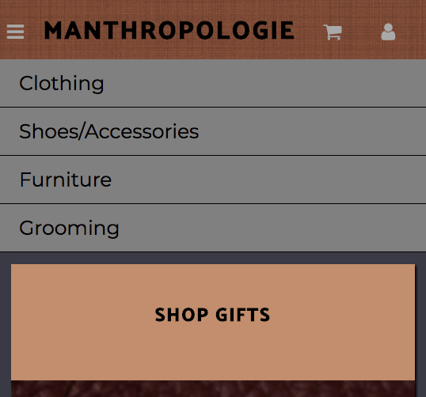
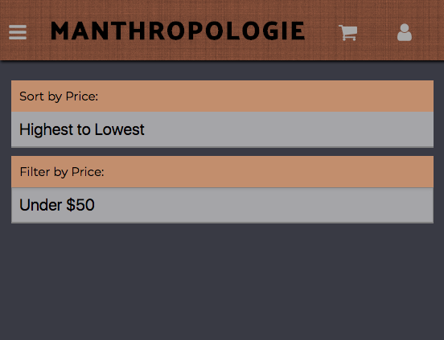

# Manthropologie

### An e-commerce website for men

#### by Jessie Waite, Adam Titus, Susannah Lowe, and Rakhee Gandhi

## Description

Check out our site:
https://manthropologie-1cc91.firebaseapp.com/

This application was created for week 5 of Epicodus' Javascript Course. This app was made in collaboration between Jessie, Adam, Susannah, and Rakhee. The app is a fake e-commerce site made using Angular.js, HTML, SASS and lots of design inspiration from Anthropologie. The app allows for both user and admin usage. Admins can log-in to manage stock by adding, editing, or removing products. Users can sign in to add products to their shopping cart. Users can "checkout", but does not allow for actual intake of personal information (at this point, because we don't actually have real products). The app uses Firebase to maintain our products.

The website was designed mobile-first.

## Technologies Needed

* Angular CLI
* Firebase
* Node.js
* SHA3 Node
* A code text editor such as Atom.

## Set-Up

- Clone the project to your desktop.
- Obtain your own firebase API Key from https://console.firebase.google.com . While you won't be able to view our products, you can see the basic structure of our website.
- Create a document called "api-keys.ts" in the "app" folder (Manthropologie/src/app/api-keys.ts). Add your API Key to this document in the following format:

      export var masterFirebaseConfig = {
          apiKey: "XXXXXX",
          authDomain: "XXXX",
          databaseURL: "XXXX",
          storageBucket: "XXXXX",
        };
  (format is located in app.module.ts for reference, if needed)
- Run $npm install
- Run $ng serve to launch the application. Open a web browser window and navigate to: http://localhost:4200 (** NG Live Development Server is running on http://localhost:4200 ** )

This project was generated with [Angular CLI](https://github.com/angular/angular-cli) version 1.0.0.

## Screenshots

#### Mobile version

#### Desktop version

## Technologies Used:

This project was build using Angular.js. We used Firebase to store product information. HTML and SCSS was used to style the page.

## Known Bugs

Because this project was built as an in-class assignment, there are no actual products to display unless you have our specific Firebase log-in information.

At this time, the  "shopping cart" link does not work unless you are logged in.

Html and styling errors cause blank white boxes appear in our products pages when we add new products.

Administrator login is not seeded and must be changed per firebase server. Only one administrator can exist at a time. Must change user id string on line 29 in header.component.ts to your user id you want to be administrator.

## Support and Contact Details

You can email Jessie, Adam, Susannah, or Rakhee with questions or comments regarding this app.

* [Jessie](https://www.linkedin.com/in/jbellwaite/) - jess.bell@me.com
* [Adam](https://www.linkedin.com/in/adam-titus/) - adamtitus76@gmail.com
* [Susannah](https://www.linkedin.com/in/susannahlowe/) - lowesusannah@gmail.com
* [Rakhee](https://www.linkedin.com/in/rakheegandhi/) - rpgandhi@gmail.com

Copyright(c) 2017
